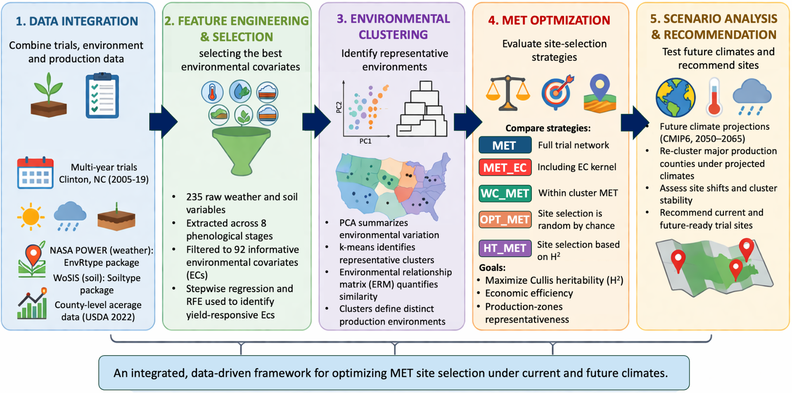

# Cucumber MET Optimization

This repository is related to a study titled: **Optimizing the U.S. Pickling Cucumber Multi-Environment Trials Using Envirotyping, Production Importance, and Future Climate Projections**.

<p align="center">
  
</p>

<p align="center">
  <b>Integrating envirotyping, environmental clustering, optimization, and future climate comparison to design more efficient cucumber multi-environment trial networks.</b>
</p>

---

## Overview

This repository contains the data, scripts, and workflow documentation used for the cucumber multi-environment trial (MET) optimization project. The project combines historical trial data, environmental covariates, clustering, scenario-based MET optimization, and future climate projections to identify more informative and cost-effective testing strategies.

The overall objective is to improve trial-network design by addressing four linked questions:

- Which environmental covariates are most relevant for cucumber yield?
- How are historical and county-level environments structured into meaningful clusters?
- How much can the testing network be reduced while preserving useful genetic information?
- How should present and future environmental structure inform trial recommendations?

---

## Repository structure

```text
Cucumber_MET_Optimization/
├── Data/
│   ├── raw/
│   └── processed/
├── Figures/
├── Outputs/
├── Scripts/
│   ├── 01_multiyear_env_data_and_predictor_selection_simple.R
│   ├── 02_multilocation_env_data_and_predictor_selection_simple.R
│   ├── 03_combine_final_predictors_simple.R
│   ├── 04_present_counties_env_processing_simple.R
│   ├── 05_met_optimization_models_FINAL_from_analysis.R
│   ├── 06_present_future_clustering_and_alluvial.R
│   ├── README_env_data_processing.md
│   └── future_climate_projections/
│       ├── cmip6_future_weather_colab.ipynb
│       ├── cmip6_future_weather.py
│       └── README_future_climate_projections.md
├── Cucumber_MET_OPT.Rproj
└── README.md
```

---

## Main workflow

The core environmental analysis workflow is located in `Scripts/`:

1. `01_multiyear_env_data_and_predictor_selection_simple.R`  
   Multi-year trial (MYT) environmental extraction, processing, predictor selection, and clustering.

2. `02_multilocation_env_data_and_predictor_selection_simple.R`  
   Multi-location trial (MLT) environmental extraction, processing, predictor selection, and clustering.

3. `03_combine_final_predictors_simple.R`  
   Combines selected predictors from the MYT and MLT workflows.

4. `04_present_counties_env_processing_simple.R`  
   Processes present county-level environmental data for downstream analyses.

5. `05_met_optimization_models_FINAL_from_analysis.R`  
   Compares MET optimization scenarios using historical trial data.

6. `06_present_future_clustering_and_alluvial.R`  
   Clusters present and future environments separately and creates alluvial-ready comparison outputs.

The future climate extraction workflow is located in:

- `Scripts/future_climate_projections/`

---

## Data

### `Data/raw/`
Contains the main raw inputs used in the project:
- `MYT_metadata.xlsx`
- `MYT_yield.xlsx`
- `MLT_metadata.xlsx`
- `MLT_yield.xlsx`
- `county_acerage.xlsx`

### `Data/processed/`
Contains processed and analysis-ready files, including:
- `Wmatrix_MYT.csv`
- `Wmatrix_MLT.csv`
- `selected_EC_MYT.csv`
- `selected_EC_MLT.csv`
- `W_present.csv`
- `future_matrix_Mar_Jun.csv`
- `future_matrix_Apr_Jul.csv`
- `Scenarios_summary.csv`

Detailed notes for these folders are available in:
- `Data/raw/README.md`
- `Data/processed/README.md`

---

## Recommended run order

Run the main workflow in this order:

1. `01_multiyear_env_data_and_predictor_selection_simple.R`
2. `02_multilocation_env_data_and_predictor_selection_simple.R`
3. `03_combine_final_predictors_simple.R`
4. `04_present_counties_env_processing_simple.R`
5. future climate extraction workflow in `Scripts/future_climate_projections/`
6. `06_present_future_clustering_and_alluvial.R`
7. `05_met_optimization_models_FINAL_from_analysis.R`

---

## Documentation

Additional workflow details are available in:

- `Scripts/README_env_data_processing.md`
- `Scripts/future_climate_projections/README_future_climate_projections.md`
- `Data/raw/README.md`
- `Data/processed/README.md`

---

## Reproducibility notes

- File names in the scripts should match the files stored in `Data/raw/` and `Data/processed/`.
- Environment names should be standardized before joining present and future datasets.
- Present and future environments are clustered separately in the comparison workflow.
- Some scripts depend on outputs generated by earlier steps.
- Processed future climate data should be exported in reproducible formats such as `.csv` for downstream analyses.

---

## Intended use

This repository is designed as a research workflow archive for:

- reproducible analysis
- manuscript support
- figure and table generation
- future extension of cucumber MET optimization under changing environments

---

## Citation

If you use or adapt this workflow, please cite the associated study once available.

---

## License

This repository is released under the **MIT License**. See the `LICENSE` file for details.

---

## Contact

For questions about the workflow or repository structure, please contact Kashish Grover (grvrkashish@gmail.com).
